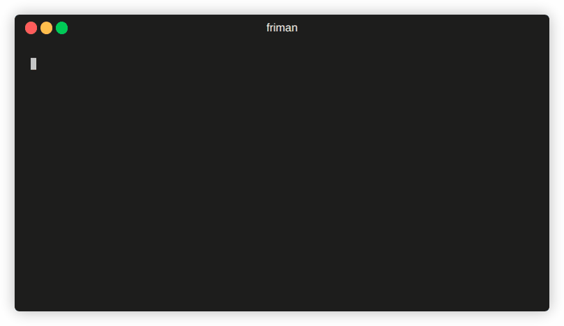

<h1 align="center">
    <br />
    
    <br />
    <b>friman</b>
</h1>

<p align="center">
    <a href="./README.md"></a>
    <a href="./LICENSE"></a>
</p>

Do you ever feel that finding the right Frida version for the job is like threading a needle? With different projects, devices, and debugging scenarios all requiring specific builds, keeping track of Frida versions can quickly become a tedious balancing act. `friman` (pronounced "*free man*") is designed to solve exactly this problem.

## Why
It’s common to switch between Frida versions because different environments don’t always behave the same with the latest release. Depending on what you’re targeting, a specific version may be the only one that works reliably. Common reasons include:

- **Device/OS quirks**: Older or unusual Android/iOS builds may only work with certain Frida versions.
- **Project compatibility**: Some scripts, tools, or workflows rely on behavior from a specific release (e.g. a lot of APIs changed between `v16` and `v17`).
- **Stability vs. features**: Newer versions fix some issues but can introduce others, so the “right” version is not always the newest.

## Overview

[Frida](https://github.com/frida/frida) evolves rapidly, and different projects or devices often require different versions. Switching manually can be error-prone, especially when juggling multiple environments, server binaries, and gadgets.

`friman` provides:

- Version installation and seamless switching
- Local version tracking
- A clean, isolated directory structure (`$HOME/.friman`)
- Helpers for downloading release assets (currently `frida-gadget` and `frida-server` assets)
- Convenience utilities for actions like pushing Frida server binaries to *Android* devices

Its goal is to make *Frida* version management **as frictionless as possible**.



## Install

The recommended installation method is directly from *GitHub*:

```sh
# With pipx (recommended)
pipx install git+https://github.com/thelicato/friman

# Or with pip
pip install git+https://github.com/thelicato/friman
```

After installing run the following:

```sh
friman ensurepath # Setup PATH and PYTHONPATH
friman update # Update the local list of available Frida versions
```

## Usage

`friman` provides a command-line interface for installing, switching, and managing multiple versions of Frida. The following is the main help output:

```
Usage: friman [OPTIONS] COMMAND [ARGS]...

Options:
  -v, --version  Show the application's version and exit.
  -d, --debug    Show debug output.
  -h, --help     Show this message and exit.

Commands:
  update       Update the local list of available Frida versions.
  install      Install a <version> of Frida.
  uninstall    Uninstall a <version> of Frida.
  use          Use <version>.
  disable      Disable friman.
  current      Display the currently activated version of Frida.
  list         List all the installed versions.
  ensurepath   Ensure friman directories are correctly set.
  download     Download a specific release file (only server and gadget)...
  push-server  Pushes a the Frida server into the selected ANDROID device.
```

Specific help commands are available in the below sections.

<details>
<summary>
<code>update</code> command
</summary>

### `update` command

```
Usage: friman update [OPTIONS]

  Update the local list of available Frida versions.

Options:
  -h, --help  Show this message and exit.
```

</details>

<details>
<summary>
<code>install</code> command
</summary>

### `install` command

```
Usage: friman install [OPTIONS] version

  Install a <version> of Frida.

Arguments:
  version  The version of Frida to install  \[required]

Options:
  -f, --force  Force install.
  --list       Show all the installable versions and exit.
  -h, --help   Show this message and exit.
```
</details>

<details>
<summary>
<code>uninstall</code> command
</summary>

### `uninstall` command

```
Usage: friman uninstall [OPTIONS] version

  Uninstall a <version> of Frida.

Arguments:
  version  The version of Frida to uninstall  \[required]

Options:
  -h, --help  Show this message and exit.
```

</details>

<details>
<summary>
<code>use</code> command
</summary>

### `use` command

```
Usage: friman use [OPTIONS] version

  Use <version>.

Arguments:
  version  The version of Frida to use  \[required]

Options:
  -h, --help  Show this message and exit.
```

</details>

<details>
<summary>
<code>disable</code> command
</summary>

### `disable` command

```
Usage: friman disable [OPTIONS]

  Disable friman.

Options:
  -h, --help  Show this message and exit.
```

</details>

<details>
<summary>
<code>current</code> command
</summary>

### `current` command

```
Usage: friman current [OPTIONS]

  Display the currently activated version of Frida.

Options:
  -h, --help  Show this message and exit.
```

</details>

<details>
<summary>
<code>list</code> command
</summary>

### `list` command

```
Usage: friman list [OPTIONS]

  List all the installed versions.

Options:
  -h, --help  Show this message and exit.
```

</details>

<details>
<summary>
<code>ensurepath</code> command
</summary>

### `ensurepath` command

```
Usage: friman ensurepath [OPTIONS]

  Ensure friman directories are correctly set.

Options:
  -h, --help  Show this message and exit.
```

</details>

<details>
<summary>
<code>download</code> command
</summary>

### `download` command

```
Usage: friman download [OPTIONS] type platform

  Download a specific release file (only server and gadget) for the current
  version.

Arguments:
  type      The selected asset type  \[required]
  platform  The platform to use  \[required]

Options:
  -o, --output TEXT  Select the folder where to download the file.
  -h, --help         Show this message and exit.
```

</details>

<details>
<summary>
<code>push-server</code> command
</summary>

### `push-server` command

```
Usage: friman push-server [OPTIONS] device_id platform

  Pushes a the Frida server into the selected ANDROID device.

Arguments:
  device_id  The selected ANDROID device  \[required]
  platform   The platform of the device  \[required]

Options:
  --list      Show all the USB devices and exit.
  -h, --help  Show this message and exit.
```

</details>

## Contributing

Pull requests are welcome! Please open an issue first to discuss major changes.

## License

_friman_ is released under the [MIT LICENSE](./LICENSE)